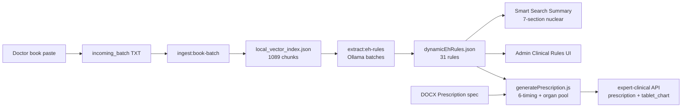

# EH — Book Text → Ollama Rules → Clinical Output (कल + DOCX कनेक्शन)

**DOCX स्रोत:** `EH_Complete_Prescription_Cursor-1 (1).docx`  
**प्रोजेक्ट कॉपी:** `docs/EH_Complete_Prescription_Cursor_extract.txt`

---

## तीन परतें (क्या जुड़ा है)



| परत | क्या है | स्टेटस (आज) |
|-----|---------|----------------|
| **1. Book ingest** | कल paste किया पाठ → `doctor_supplied/page_*.txt` → RAG | ✅ **1089 chunks**, 264 pages |
| **2. Rule extract** | RAG → Ollama → `backend/data/dynamicEhRules.json` | ✅ **31 rules** (Admin से edit) |
| **3. Live clinical** | Rules → `expertClinicalSummaryService` → 7-खंड सार | ✅ **Nuclear rule-only** (कोई 11-खंड/Ollama creative नहीं) |
| **4. DOCX prescription** | `generatePrescription.js` + `prescriptionEngineData.js` | ✅ **100% automated** — temperament/organ/lab/symptom pool, 6-timing chart, rule-locked विद्युत/पोटेंसी |

---

## कल जो किया था — वही pipeline

### Step A — पाठ डालना
```
backend/book/extracted/incoming_batch/page_9001.txt … page_9264.txt
```
फिर:
```powershell
npm run ingest:book-batch
npm run ingest:book-status
```

### Step B — Ollama से rules निकालना
`.env` में:
```env
EH_RULE_EXTRACT_ALLOW=1
OLLAMA_URL=http://127.0.0.1:11434
EH_RULE_EXTRACT_MODEL=qwen2.5-coder:1.5b
```
फिर:
```powershell
npm run extract:eh-rules -- "धनात्मक ऋणात्मक उच्च रक्तचाप निम्न विद्युत पोटेंसी"
```
या Admin UI: **http://localhost:5173/admin/clinical-rules** → Generate from book

**आउटपुट:** `backend/data/dynamicEhRules.json`

### Step C — Smart Search पर लागू
1. `npm run dev` (backend)
2. `npm run expert-engine` (formula analyze)
3. Analyze → Summary API → terminal में `[EH NUCLEAR] Dynamic rules only`

---

## DOCX vs अभी की ऐप (महत्वपूर्ण)

| DOCX में लिखा है | Repo में अभि |
|------------------|-------------|
| **11-section** summary | **7-section** (`dynamicRuleOnlySummary.js`) — जानबूझकर |
| `ELECTRICITY_MAP` — hypo→R.E., joints→G.E. | **dynamicEhRules** — hypo→**WE**, high BP→**BE** |
| `generatePrescription.js` | ✅ **`backend/services/`** — DOCX `ELECTRICITY_MAP` **नहीं** |
| `cdss.js` analyze route | **अलग routes:** `/api/summary/expert-clinical` |

DOCX का **Temperament → A/S/F group** logic अभी **expert engine + formulas** में है; **विद्युत/पोटेंसी lock** केवल `dynamicEhRules.json` से होता है।

---

## DOCX prescription (लागू)

1. **`backend/services/generatePrescription.js`** — `selectMedicines()` scoring pool; **electricity/potency** केवल `determineUniversalClinicalRules()` / `dynamicEhRules.json`.
2. **`backend/services/prescriptionEngineData.js`** — temperament groups, organ pools (`ORGAN_ALIAS` → `ehOrganDetect` keys), lab/symptom boosts.
3. **API:** `POST /api/summary/expert-clinical` → `prescription`, `tablet_chart` (7 rows: 6 internal + D external), `prescription_json`.
4. **UI:** `SearchResult.jsx` — markdown prescription + 6-timing table.

पुराना “अगला कदम” (अब पूरा):

1. ~~`generatePrescription.js` बनाएं~~ — ✅
2. Summary = 7-खंड (DOCX की 11-खंड लाइन हटाएं).
3. एक API: Analyze → summary + prescription एक साथ.

---

## जल्दी जाँच कमांड

```powershell
npm run ingest:book-status
node -e "const j=require('./backend/data/dynamicEhRules.json'); console.log('rules',j.ruleCount,j.updatedAt)"
```

Ollama चल रहा हो:
```powershell
npm run extract:eh-rules -- "निम्न रक्तचाप सफेद विद्युत WE"
```

---

## संक्षेप (आपके लिए)

- **कल की book** → ✅ ingest + RAG में जुड़ी है.  
- **Ollama rules** → ✅ `dynamicEhRules.json` में जुड़ी हैं.  
- **Smart Search summary** → ✅ उन्ही rules से चलती है (nuclear).  
- **DOCX prescription file** → अभी **spec/blueprint** है; पूर्ण `generatePrescription.js` install करना बाकी है — पुराना `ELECTRICITY_MAP` लगाने से फिर G.E./R.E. गलती आएगी, इसलिए prescription भी dynamic rules से lock करनी होगी.
